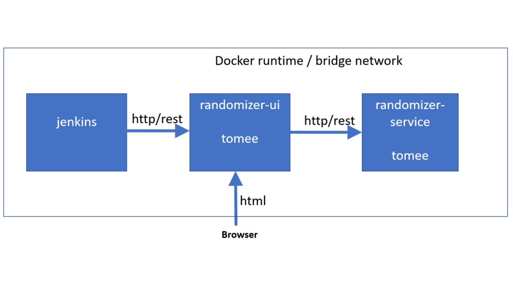

#Tutorial: Continuous Build, Test and Integration on Jenkins
-----------------------------------------------------------

This is a tutorial for the automated build, deploy, and integration test of a composite application in a Continuous Integration Pipeline on Jenkins. 
We keep the application logic very simplistic as we want to concentrate on DevOps: automated build, test and integration locally and
on Jenkins.

Get the basic Tools
-------------------

* Download and install Java SE Development Kit 8 from <https://www.oracle.com/technetwork/java/javase/downloads/jdk8-downloads-2133151.html>.
* Download and install Docker Desktop for Windows from <https://docs.docker.com/docker-for-windows/install/>.
* Download and install Maven for Windows from <https://maven.apache.org/download.cgi>.

Get the Application
-------------------

Clone the git repository

 ```
 cd %homedrive%\%homepath%\git\
 git clone https://github.ibm.com/devops4us/randomizer.git
 ````

The following picture shows the architecture of our simple example application `Randomizer`.


There are two servers which implement our application as an integrated system.
`randomizer-ui` is a HTML5 user interface application server based on the Vaadin Framework (<https://vaadin.com/docs/index.html>) and the Apache TomEE platform (<http://tomee.apache.org/apache-tomee.html>).
The application is accessed from a browser. 
It demonstrates a simple UI visualising the generation of random numbers.
The random generator itself is hosted on another server and is accessed from the user interface as HTTP/REST API.
The `randomizer-ui` application server calls `randomizer-service`, which is also running on top of TomEE.

**Development Environment:** The developer can start each server locally on her development machine (Windows 10 Laptop in my case).

**Test Environment:** In order to be globally deployable for integration test, the servers are each packaged as docker images based on the TomeEE docker image (see <https://docs.docker.com/samples/library/tomee/>).
Each server image runs in a separate docker container. 
For build and integration, we use Jenkins in a dockerized version. 
To test the integrated servers, Jenkins calls a rest service from `randomizer-ui` which in turn calls `randomizer-service`. 

Develop the Servers in Isolation
-------------------------------------------------------------------------------------

Server Development often starts with isolated servers being started locally. 
This is especially true for the user interface server - the user interface can be tested by mocking away the backend services.
In our UI application, in class `RandomizerBean`, if the service is not available, the value `-1` is simply generated as dummy random number. 

To run to UI service in isolation, execute the following in a DOS shell:

 ``` bash
cd %homedrive%\%homepath%\git\randomizer\ui\
mvn package tomee:run
 ```

If you see in the DOS shell that the server started successfully, open this URL in your favorite browser: <http://localhost:9090/randomizer-ui>. 
If you click "Get Random Number from Server", you'll see -1 in the message box in your browser. 
This is ok, because the Randomizer Service is unavailable for now. 
We are still able to test the isolated UI, even if we get a dummy value instead of real random numbers.

Note that we called the goal `tomee:run` in the maven command line above. 
The reason why we can do this is the TomEE Maven Plugin (<http://tomee.apache.org/tomee-maven-plugin.html>). 
If you include this plugin in your `pom.xml`, as we did, the above command line will start a local TomEE server which hosts just your web application, `randomizer-ui`in our case.
See the TomEE documentation and the content of file `randomizer\ui\pom.xml`.    

Deploy the integrated Application locally
-----------------------------------------------------

Now we enter the Docker world. 
A *Dockerfile* is used to define a docker image.
Let's take a look at file `.\Docker\ui\Dockerfile`, which is the Dockerfile defining the `randomizer-ui` web application container.

```
1 FROM tomee:latest
2 COPY tomcat-users.xml /usr/local/tomee/conf
3 COPY manager-context.xml /usr/local/tomee/webapps/manager/META-INF/context.xml
4 COPY randomizer-ui.war /usr/local/tomee/webapps/
```

Line 1 defines the base image, which is a dockerized TomEE.
Lines 2-3 configure the Tomcat Manager application to accept user/password `admin/admin` so we can access Tomcat Manager from the browser.
Line 4 deploys the application `randomizer-ui` to TomEE as a web application by copying the package `randomizer-ui.war` to TomEE's web application directory.
The result of building with this Dockerfile is an image for `randomizer-ui`, based on TomEE, and ready to be started as Docker container. 
Look at file `.\Docker\service\Dockerfile` which does the same for `randomizer-service`.   

Instead of starting each docker image manually with the docker command line, we use Docker Compose (<https://docs.docker.com/compose/>). 
With Compose, you define all the servers - the used images, their volume mappings, port mappings, networks, etc - in a single *Compose file*. 
They are then started and stopped together using Docker Compose command line.
Note that beyond what is shown in this tutorial, Docker Compose can be used to simplify various other tasks, e.g. access to the log files of all the running containers, see  (<https://docs.docker.com/compose/>).

Let's have a look to the Compose file for our application, `.\Docker\docker-compose.yml`:

``` yaml
1 version: "3"
2 services:
3   randomizer-service:
4      networks:
5      - default    
6      hostname: randomizer-service
7      ports:
8      - "9080:8080" 
9      build: ./service 
10     image: randomizer-service            
11  randomizer-ui:
12    networks:
13    - default
14    hostname: randomizer-ui
15    ports:
16    - "9090:8080"
17    build: ./ui
18    image: randomizer-ui
19    environment:
20    - RANDOMIZER_SERVER_NAME=randomizer-service
21    - RANDOMIZER_SERVICE_PORT=8080
22 networks:
23   default:
24      external: 
25        name: integration_net
```

Note that for each service, we define some networking parameters like networks (lines 4, 12), host name (lines 6, 1) and port mappings (lines 7-8, 15-16). 
As we do so, each service is accessible from within the Docker network by the defined host name and from outside by the defined port.
The characteristics of the Docker network itself are specified in lines 22-25, saying that our containers are be accessible from the virtual network `integration_net` which has to be defined elsewhere (`external`).
Background is that the virtual network `integration_net` will be created and managed by the Jenkins build/integration server.  

The services are also accessible from the docker host (Windows 10 desktop in my case) as `localhost:9080` and `localhost:9090`. 
For instance, the user interface, once started in my local docker, is accessible from my Windows browser at URL `localhost:9090/randomizer-ui`. 
This is because we defined port mappings which make the docker containers accessible from the docker host machine.

To start all the servers in Docker, Execute the following in a DOS shell:

``` bash
cd %homedrive%\%homepath%\git\randomizer\Docker
docker network create integration_net
docker-compose up -d
 ```

Enter this URL in your favorite browser: <http://localhost:9090/randomizer-ui>. 
If you click "Get Random Number from Server", a positive number should appear in a message box.
If you still see a -1, the Randomizer Service is not functioning.
If you want to see the server logs, enter

``` bash
cd %homedrive%\%homepath%\git\randomizer\Docker
docker-compose logs
```

Run Local Integration Test
---------------------------

As we are able to launch all our servers in a local Docker, we can also run the server integration tests locally. 
For integration testing, we use the Maven lifecycle phases and the Maven Failsafe Plugin (<http://maven.apache.org/surefire/maven-failsafe-plugin/>).
The configuration can be viewed in file `.\ui\pom.xml` (the integration test cases are part of the ui project because in our example integration is tested via the ui service).
In the POM-file, you can see that we configure a Maven profile named `integration` in which we do all the integration test preparation and execution. 

``` xml
69   <profiles>
70       <profile>
71         <activation>
72            <property>
73              <name>PROFILE</name>
74              <value>integration</value>
75            </property>
76         </activation>
77         <id>integration</id>
78         <build>
79         <plugins>
80            <plugin>
81               <groupId>org.apache.maven.plugins</groupId>
82               <artifactId>maven-antrun-plugin</artifactId>
83               <version>1.8</version>
84               <executions>   
85                  <execution>
86                     <id>package</id>
87                     <phase>package</phase>
88                     <configuration>
89                        <target><copy file="target/randomizer-ui-PROJ_VERSION.war" tofile="../Docker/ui/randomizer-ui.war" /></target>
90                     </configuration>
91                     <goals>   <goal>run</goal></goals>
92                  </execution>               
93                  <execution>
94                     <id>pre-integration-test</id>
95                     <phase>pre-integration-test</phase>
96                     <goals>   <goal>run</goal> </goals>
97                     <configuration>
98                        <target>
99                           <exec executable="docker-compose" dir="../Docker"><arg value="build" />   </exec>
100                           <exec executable="docker-compose" dir="../Docker">
101                              <arg value="up" />
102                           <arg value="-d" />
103                        </exec>
104                        </target>
105                     </configuration>
106                 </execution>
107                 <execution>
108                     <id>post-integration-test</id>
109                     <phase>post-integration-test</phase>
110                     <goals>   <goal>run</goal></goals>
111                     <configuration>
112                        <target>
113                           <exec executable="docker-compose" dir="../Docker"><arg value="down" /> </exec>
114                        </target>
115                     </configuration>
116                 </execution>
117               </executions>
118            </plugin>
                ...
```

The test preparation includes building the server images and starting the containers with `docker-compose` in lines 93-106.
We use the Maven Antrun Plugin to execute the necessary `docker-compose` commands in the Maven `pre-integration-test` phase. 
After the integration test, we need to stop the containers, which is done in lines 107-117. 

To run the integration tests locally, execute the following in a DOS shell:

```
cd %homedrive%\%homepath%\git\git\randomizer\
mvn -DPROFILE=integration -DRANDOMIZER_UI_NAME=localhost^
        -DRANDOMIZER_UI_PORT=9090 verify
```

As we use the Maven Failsafe Plugin, the test classes with a class name ending with `IT` are being run for test in phase `integration-test` by convention. 
In our case, class `com.ibm.demo.RandomizerIT` is being run. 
The test results are saved as Failsafe reports in directory `.\ui\target\failsafe-reports\`.
Note that this is an integration test; we do not test the function of the user interface here. 
For that reason, `ui-server` provides an endpoint `http://localhost:9090/randomizer-ui/random`, which returns a random number - if the call to this URL succeeds with a positive number, we know that both servers, `randomizer-ui` and `randomizer-service`, are deployed correctly and work with each other.
The integration test class `com.ibm.demo.RandomizerIT` calls this URL and reports success if a positive number is returned.


Enter the CI World
-------------------------------------  

Now we enter the world of Continuous Integration servers, Jenkins in our case.
This means that for our whole development project, we will build the components periodically from the source repository, deploy them in a test environment, and test if they work together correctly.
* Jenkins can automatically build, deploy and test the integrated servers. 
This can be done on each change in the main branch or periodically.
This is why we call the process *continuous integration*.
* Each integration test run is recorded by Jenkins and available for review with all the test results via the Jenkins user interface
* The integration test servers are started and stopped with Docker Compose as needed and on demand - no integration test environment is allocated permanently  

Build a Jenkins Docker Image
----------------------------

Before we start building a Continuous Integration (CI) pipeline on Jenkins, we need a suitable Docker image. 
The standard Jenkins Docker image (<https://hub.docker.com/r/jenkinsci/jenkins>) lacks Docker Compose and Maven, which we need.
So we customize our Jenkins Docker image using a custom Dockerfile.  The following ist the content of file `Jenkins\Jenkins-Dockerfile`. It is used to build our customized Jenkins Docker image.


```
1 from jenkinsci/blueocean
2 USER root
3 RUN apk add py-pip
4 RUN apk add python-dev libffi-dev openssl-dev gcc libc-dev make
5 RUN pip install docker-compose
6 RUN apk add maven
7 RUN adduser jenkins root
8 COPY settings.xml /usr/share/java/maven-3/conf
```

Lines 3-5 install Docker Compose with the aid of python. 
Line 6 installs Maven. 
In line 7, we add 'jenkins' to the group of root users. 
This is necessary to be able to access the docker daemon within the Jenkins server. 
Line 8 copies the maven configuration (this step is not necessary here; but later you can use it to customize the Maven settings if needed).

The Jenkins Blueocean image is available from Docker Hub: <https://hub.docker.com/r/jenkinsci/blueocean/>. 
Look at this page: <https://jenkins.io/doc/> for information on how to generally configure Jenkins. 
For information on how to install Docker Compose on Jenkins Blueocean, refer to this URL: <https://wiki.alpinelinux.org/wiki/Docker>. 
For information on how to manage users and groups in the Linux Alpine image, see <https://stackoverflow.com/questions/49955097/how-do-i-add-a-user-when-im-using-alpine-as-a-base-image>.

The following DOS shell commands create local Docker image based on the above Dockerfile:

```
cd %homedrive%\\%homepath%\git\\randomizer\\Jenkins\
docker image build -t jenkins-docker -f Jenkins-Dockerfile .
```

Start Jenkins on Docker
-----------------------

Within this tutorial, we will use Jenkins as CI server in Docker.
We deploy everything on Docker Desktop for Windows.
But before we deploy Jenkins, we need to consider what will happen in our Jenkins CI server - we will define a CI pipeline in Jenkins which executes the following:

2. Checkout our Code from Git
3. Build the Docker images for `randomizer-ui`and `randomizer-service`
4. Run the Docker images on our local Docker
5. Execute the integration tests and collect reports
6. Stop the Docker images

To run the Docker images in step 3, Jenkins has to start Docker containers from within Docker, as it runs in a Docker container for itself.  
We could, theoretically, start a separate Docker host in the Jenkins Docker container, so that we had a *Docker-In-Docker* configuration, but this is not regared as a good practice (<https://jpetazzo.github.io/2015/09/03/do-not-use-docker-in-docker-for-ci/>).
The alternative is, to let the Jenkins Docker command line talk to the Docker daemon on the host (Windows 10 in my case), which is achieved by defining the *Docker socket* as a shared volume. 
This is configured during the start of the Jenkins container, see the DOS shell script below, where it says `"-v //var/run/docker.sock:/var/run/docker.sock"`. 
  
To start jenkins as Docker container from the image `jenkins` created above, run the following in a DOS shell:

```
docker network create integration_net
docker run^
 -u jenkins^
 -p 8080:8080 -p 50000:50000\^
 -v //var/run/docker.sock:/var/run/docker.sock^
 -v c:/volumeshare/jenkins_home:/var/jenkins_home^
 --name jenkins^
 --network="integration_net"^
 --rm^
 -d^
 jenkins-docker
```

Install the CI Pipeline on Jenkins
--------------------------------------------------------

We have almost achieved our final goal: To have a pipeline running for continuous build, integration and integration test of our system.
If you look carefully to the list of things we identified in [the previous section](#start-jenkins-on-docker), we already executed each of the steps without Jenkins.
So we have to let Jenkins run them in a pipeline. 
It is good luck that Jenkins supports Pipeline scripts, so we can specify our pipeline in this script file (`.\Jenkins\Jenkinsfile`):

``` 
1 pipeline {
2  agent any
3  stages {    
4    stage('integration-test') {
5      steps {
6        sh "whoami"
7        sh "mvn -DPROFILE=integration -DRANDOMIZER_UI_NAME=randomizer-ui -DRANDOMIZER_UI_PORT=8080 verify"
8      }
9     }
10  }
11 }
```
In line 2, we tell Jenkins to run that pipeline within the Jenkins Docker container.
All the magic is done in step 7, where we start our integration tests just like in section [Run Local Integration Test](#run-local-integration-test).
 
What we still need to do is to install that pipeline on the Jenkins server.
As we alreay started Jenkins it the [previous chapter](#start-jenkins-on-docker), just open the URL: <http://localhost:8080> and login with credentials `admin/admin`. 
What we see now is the jenkins management user interface. 
To define and run our pipeline, we need to click through the following steps:
1. Jenkins -> Create Element  
1. Type "Randomizer" as element name  
1.   Click "Pipeline" 
1.    Click "OK"  
1. Go to Section "Pipeline"  
1.   Select "Pipeline Script from SCM" in the Definition Field  
1.   Select "Git" in the SCM Field  
1.   Enter "https://github.com/devops4us/randomizer.git" as Repository URL  
1.   Enter "Jenkins/Jenkinsfile" as Script Path
1.   Click "Save"  
1.   Click "Build Now"  

From there on, we have a working Jenkins CI pipeline!

