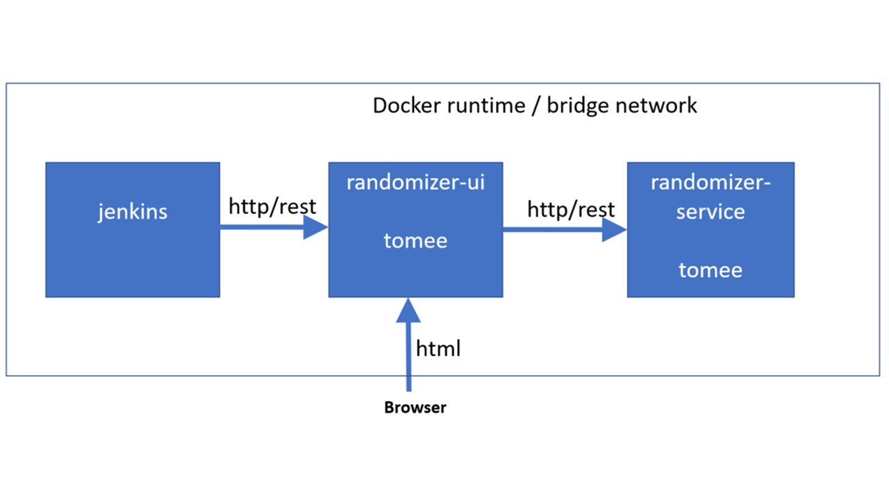

### Maven Modules
The user interface web application is in mvn module ``ui``. 
The web application with the rest service is mvn module ``service``.

### Architecture
</img>
Ui needs to communicate with the rest service. Both are based on docker image `tomee`. 

### Build & Deploy
Build and start containers using `docker-compose`: 
	The ui and service containers are started using docker-compose with file ``Docker/docker-compose-yml``.
	The containers run in a docker bridge network. The server names are ``randomizer-ui`` and `randomizer-service`.
	To build the docker containers, type:	
		
	cd Docker ; docker-compose build

To run the containers, type:

	cd Docker ; docker-compose up

### End User Test	
To test the rest service, open your browser on the docker host with `http://10.0.75.1:8080/randomizer-service/random` . To see the user interface, open your browser on docker host with `http://10.0.75.1:8090/randomizer-ui`. 

### Automated Integration Test
The following command line will package the applications, build and deploy docker images, run integration tests and finally stop the 
docker containers.

	mvn -DRANDOMIZER_UI_NAME=10.0.75.1 -DRANDOMIZER_UI_PORT=8090 verify
 
 